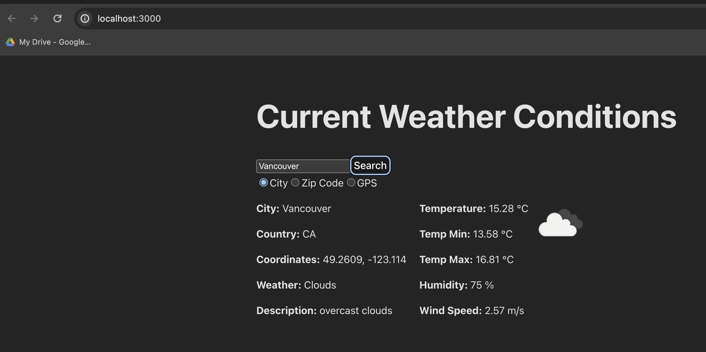
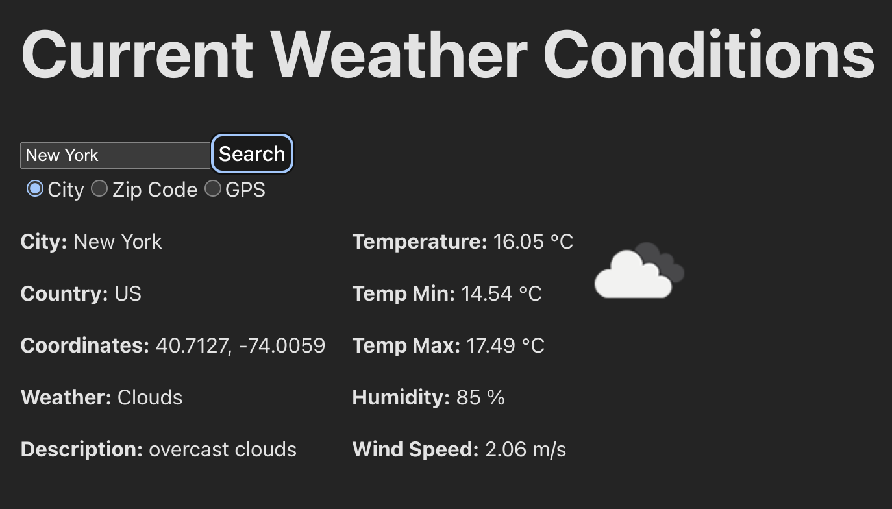
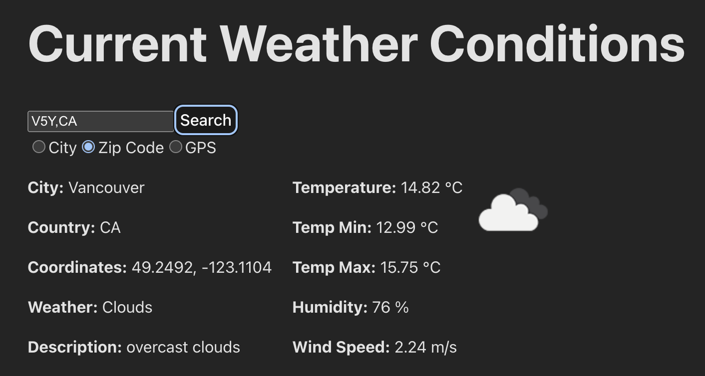
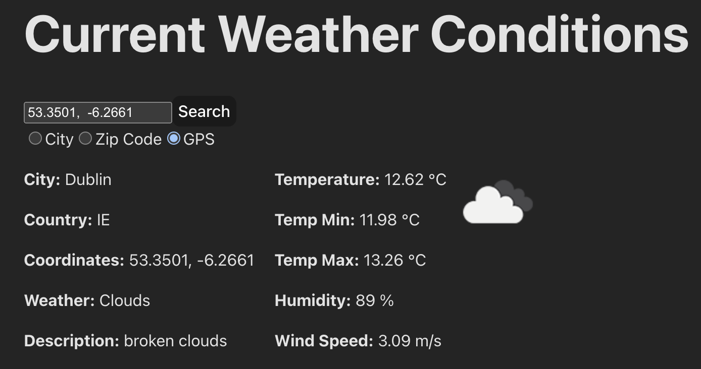
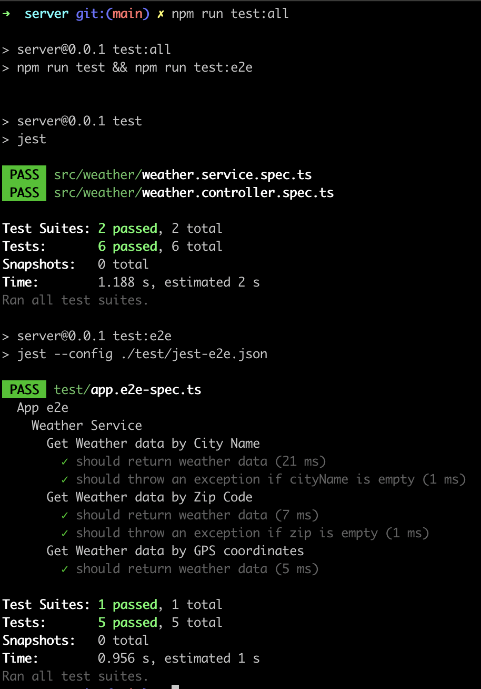

# Current Weather App

## Description

App to allow a user to search for current weather conditions by city name, zip code, or coordinates
(GPS, reverse geolocation) using the https://openweathermap.org/api API.




## Tech Stack

- NestJs framework (https://nestjs.com/) for the server-side app. It uses Node.js and TypeScript.
- React (https://react.dev/) for the front-end.
- Turbo (https://turbo.build/repo) to create the mono-repo structure.

## Getting Started 

add a .env file in root directory with the open weather api key (https://openweathermap.org/api) with the follow contents:

OPEN_WEATHER_API_KEY="your_api_key"

```bash
$ touch .env
$ echo OPEN_WEATHER_API_KEY="your_api_key" > .env
```

Run npm install to install external dependencies:

```bash
$ npm install
```

## Running the app

```bash
# build app
$ npm run build

# run server - leave running
$ npm run start

# open frontend in browser
$ open http://localhost:3000/
```

## How to use

Search by city e.g. New York:


<br>
<br>
Search by Zip Code (note, should include country code) e.g. V5T,CA:


<br>
<br>
Search by coordinates e.g. 53.3501, -6.2661:



## Tests
server-side end-to-end tests can be found in apps/server/test/app.e2e-spec.ts and unit tests can be found in apps/server/src/weather/weather.controller.spec.ts and apps/server/src/weather/weather.service.spec.ts

### Running the tests
```bash
# change to server directory
$ cd apps/server

# run all tests
$ npm run test:all

# run e2e tests
$ npm run test:e2e

# run unit tests
$ npm run test
```


